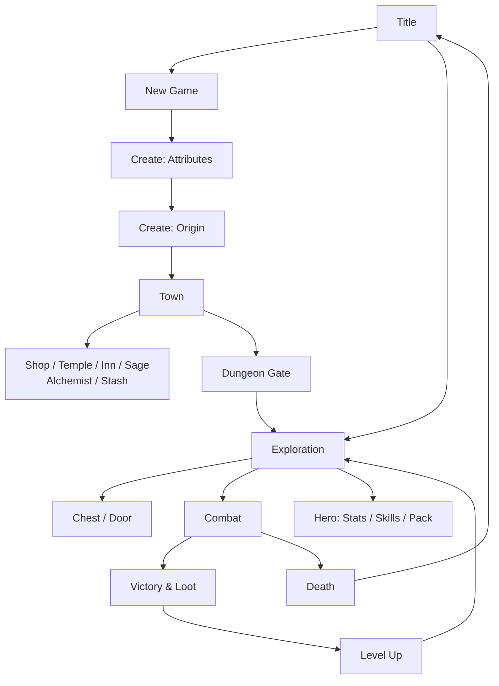

# Underkeep — Mobile Build Outline

Exported from the living doc on 2026-09-16. If the two differ, update this file and note it in `docs/DECISIONS.md`.

## Goal and scope

Build Underkeep as a fullscreen, installable web app. On phones it runs portrait at a strict 9:18 ratio; on tablets and in landscape it runs at 18:9, from the same source and the same screen definitions. The page never scrolls; only marked list panels do. Every one of the 26 screens is mocked in `docs/design/mockups/` and mapped row by row below.

The game implements six rule documents:

| Document | What the code takes from it |
| --- | --- |
| `rules/01-core-rules.md` | Attributes, derived stats, skill tree, conditions, leveling |
| `rules/02-bestiary.md` | Monster stat blocks, elites, encounter tables, loot roll |
| `rules/03-traps-locks-treasure.md` | Search, disarm, pick, bash, chest sequence, hazards |
| `rules/04-item-database.md` | Every item, identification, curses, shop tiers, Alchemist |
| `rules/05-dungeon-generation-saving.md` | Floor generator, solvability check, waystones, save format |
| `rules/06-combat-engine-ai.md` | Turn order, damage order, event hooks, monster scripts |

**Out of scope for version 1:** online features, cloud saves, in-app purchases, and landscape mode.

## Tech stack and project structure

Use plain JavaScript with no framework, organized as ES modules during development and bundled into a single HTML file for release. The engine never touches the page, so rules can be tested without a browser.

| Layer | Choice | Why |
| --- | --- | --- |
| Rendering: dungeon view | Canvas 2D DDA raycaster | Fixed grid floors, fast on phones |
| Rendering: menus | Plain DOM with CSS grid | Crisp text, easy accessibility |
| Game logic | Pure JS modules, no DOM | Testable, reusable for a balance simulator |
| Randomness | sfc32 streams (layout, encounter, combat, loot, restock) | Reload-proof luck |
| Storage | IndexedDB, settings in localStorage | Saves up to about 200 KB each |
| Offline | Service worker + web app manifest | Installable, works in airplane mode |
| Build | esbuild, then inline everything into one HTML | Single-file release |

```
underkeep/
  index.html            one root element: #app
  src/
    shell/              9:18 frame, input, router, haptics
    ui/screens/         one module per screen (26)
    ui/parts/           buttons, bars, lists, sheets, chips
    engine/             combat, conditions, hooks, AI runner
    dungeon/            generator, solvability, raycaster, automap
    systems/            items, loot, shops, traps, leveling
    save/               serializer, migrations, IndexedDB
    data/               JSON built from the rule documents
  tools/                data builder, balance simulator
  test/                 rule tests
```

## The 9:18 fullscreen shell

The whole game lives in one frame that is exactly 9 units wide by 18 units tall. One unit is the largest size that fits the screen, so the frame never scrolls, crops, or stretches; any leftover space becomes a plain black letterbox.

**The layout grid.** Every screen is a CSS grid of 9 columns and 18 rows with a small fixed gap. Each element is placed by column and row span, which is how the screen layouts below are written (for example, "cols 1–9, rows 3–10"). Tap targets always span at least 2 rows, which is about 80 px on a 390 px-wide phone.

```css
html, body {
  margin: 0; height: 100%; overflow: hidden;
  overscroll-behavior: none; touch-action: manipulation;
  background: #0B0908; -webkit-user-select: none; user-select: none;
}
body { position: fixed; inset: 0; }
#app {
  --u: min(
    (100vw - env(safe-area-inset-left) - env(safe-area-inset-right)) / 9,
    (100dvh - env(safe-area-inset-top) - env(safe-area-inset-bottom)) / 18
  );
  position: absolute; left: 50%; top: 50%;
  width: calc(var(--u) * 9); height: calc(var(--u) * 18);
  transform: translate(-50%, -50%);
  display: grid; overflow: hidden;
  grid-template-columns: repeat(9, minmax(0, 1fr));
  grid-template-rows: repeat(18, minmax(0, 1fr));
  gap: calc(var(--u) * 0.14); padding: calc(var(--u) * 0.18);
  box-sizing: border-box;
  font-size: calc(var(--u) * 0.36);
}
.scroll { min-height: 0; overflow-y: auto; overscroll-behavior: contain; }
```

**Rules for the shell**

- **Viewport tag:** `width=device-width, initial-scale=1, viewport-fit=cover, user-scalable=no`.
- **Sizes in units:** fonts, borders, and radii are multiples of `--u`, so the design looks identical on every phone. The mockups use a 390 × 780 frame, where 1 unit is about 43 px.
- **No page scroll:** the body is fixed and `overflow: hidden`. Only elements with the `scroll` class scroll, and they stop scroll chaining so the page never bounces.
- **No accidental zoom or selection:** double-tap zoom and text selection are off everywhere except text inputs.
- **Fullscreen:** the manifest sets `display: fullscreen` and `orientation: portrait`. In a normal browser tab, the first tap calls `requestFullscreen()` where supported.
- **Resize:** the unit is recalculated from CSS alone, so rotating or showing the keyboard can't break the layout. Text inputs move into view with `scrollIntoView` inside their panel, never by scrolling the page.
- **Landscape:** switches to the wide 18 × 9 frame described in the next section. The same screens and the same code serve both.

## Tablet and landscape layout

The same source runs in two frames: **tall** (9 × 18) and **wide** (18 × 9). A wide screen is the tall screen cut in half and set side by side, so nothing is re-authored: every region keeps its size in units and its place in the reading order.

```css
/* wide frame */
#app.wide {
  --u: min(
    (100vw - env(safe-area-inset-left) - env(safe-area-inset-right)) / 18,
    (100dvh - env(safe-area-inset-top) - env(safe-area-inset-bottom)) / 9
  );
  width: calc(var(--u) * 18); height: calc(var(--u) * 9);
  grid-template-columns: repeat(18, minmax(0, 1fr));
  grid-template-rows: repeat(9, minmax(0, 1fr));
}
```

**Choosing the frame.** The shell picks by shape, not by device: `wide` when the viewport's aspect ratio is 1.2 or higher, `tall` otherwise. It re-checks on resize and rotation and re-renders the current screen; game state never changes. A maximum unit size of 72 px keeps a big tablet from turning into giant buttons: past that, the frame is centered with letterbox bars.

| Device | Frame | Unit (about) |
| --- | --- | --- |
| Phone portrait, 390 × 844 | tall | 43 px |
| Phone landscape, 844 × 390 | wide | 43 px |
| Tablet portrait, 820 × 1180 | tall | 65 px |
| Tablet landscape, 1180 × 820 | wide | 65 px |
| Tablet landscape, 1366 × 1024 | wide | 72 px (capped) |

**The fold rule (the default).** Each screen declares a fold row, which is row 9 unless the screen says otherwise. In the wide frame, rows above the fold go to the left half (columns 1–9) and rows below it go to the right half (columns 10–18), each keeping its own row number within a 9-row half. A region that crosses the fold needs an explicit wide placement, given below. A screen module declares its regions once and the layout engine places them for whichever frame is active:

```js
region('log', { tall: [1, 9, 11, 12], wide: [4, 15, 8, 9] })  // cols a–b, rows c–d
```

**Four wide patterns.** A plain fold only works when no region crosses row 9, which is true for about a quarter of the screens. Every other screen uses one of four shared patterns, so the layout engine still does the work and no screen is authored twice.

| Pattern | Left half (cols 1–9) | Right half (cols 10–18) |
| --- | --- | --- |
| **Fold** | Rows 1–9 as written | Rows 10–18 as written |
| **Stage + controls** | The thing you look at: view, map, tombstone, enemy rows | Every control, under the thumbs |
| **List + detail** | Tabs and the scrolling list | Detail panel, cost line, primary button |
| **Panel** (sheets) | The screen underneath, dimmed | The sheet as a panel, cols 11–18, buttons at the bottom |

**Every screen, and which pattern it uses.**

| Screen | Pattern | Wide layout |
| --- | --- | --- |
| Title | Fold + nudge | Logo rows 1–6 and the last-played card rows 7–9 left; the four buttons stacked right |
| New Game | Fold + nudge | Mode cards left; difficulty, roll style, seed, and BEGIN right |
| Create: Attributes | Fold + nudge | Attributes 1–3 left, 4–6 right, with the HP/FP/DEF preview and REROLL / NEXT under them |
| Create: Origin | List + detail | Four origin cards left; name input, kit, and the primary button right |
| Town Hub | Fold + nudge | Bars and three services left; three services and DUNGEON GATE right |
| Shop, Temple, Inn, Sage, Alchemist, Dungeon Gate | List + detail | Tabs and list left; detail, cost, and the primary button right |
| Stash | List + detail (two lists) | Pack left, stash right, move buttons in row 9 under each |
| Exploration | Stage + controls | View cols 4–15 rows 2–7, log below it. Context key and movement pad cols 1–3; MAP, PACK, HERO, CAMP cols 16–18 |
| Automap | Stage + controls | Map cols 1–14; legend and zoom stacked in cols 15–18 |
| Chest / Door | Stage + controls | View and info card left; the 3 × 3 action grid cols 10–18 |
| Pause Menu | Fold | PAUSED and RESUME left; the other entries and QUIT right |
| Combat | Stage + controls | Back row, front row, and log cols 1–12; actions in a 2 × 3 grid and quick slots cols 13–18 |
| Combat: Skills, Item Detail, Reaction | Panel | Dimmed screen left; the sheet as a right-hand panel |
| Victory & Loot | List + detail | Drop list left; XP, gold, warnings, TAKE ALL and CONTINUE right |
| Level Up | Fold | LEVEL N and the four gain tiles left; attribute picker and buttons right |
| Death | Stage + controls | Tombstone left; score, run stats, and buttons right |
| Hero: Stats | Fold | Attribute tiles left; derived list and XP bar right |
| Hero: Skill Tree | List + detail | Tiers cols 1–12, 4 tiles per line; selected skill and LEARN cols 13–18 |
| Hero: Pack | List + detail | Equipped strip and item list cols 1–12; item detail cols 13–18 as a panel, not a sheet |
| Settings | List + detail (two columns) | Settings split into two columns; EXPORT and IMPORT in row 9 |
| Hall of the Dead | List + detail | Records left; the selected record's tombstone right |

**Three things to watch while building the wide frame**

- **The dungeon view changes shape.** It's roughly square in the tall frame and about 2:1 in the wide one, so the raycaster takes its aspect ratio and field of view from the frame instead of hard-coding them. Keep the vertical field of view fixed so wall height doesn't jump when the player rotates the device.
- **Safe areas move to the sides.** In landscape the notch and home indicator eat left and right. The `--u` formula already subtracts them; keep controls inside the padding, never flush to the edge.
- **Lists hold about the same number of rows.** A wide list panel is 7 rows instead of 9, but the unit is larger on a tablet, so the pixel height is similar. Don't add a second column to a list to use the space — the detail panel is already using it.

**Rules that don't change:** the 2-row minimum for tap targets, one primary button per screen, `.scroll` panels as the only scrolling areas, and every size in `--u`. Two rows in the wide frame is a bigger target than in the tall frame, so nothing shrinks.

**Mockups:** `ExploreWide.html`, `CombatWide.html`, `ShopWide.html`, and `SkillTreeWide.html` show the wide frame at 1008 × 504. Every other screen follows the fold rule.

**Testing:** repeat each phone check in landscape and on a tablet, and add a rotation test: rotating mid-combat keeps the same state, turn, and log.

## Visual design system

The look is dark, high-contrast, and chunky: thick bone-colored outlines, one amber accent for the main action on each screen, and big uppercase labels. Color always has a text or icon backup, so nothing depends on color alone.

| Token | Value | Used for |
| --- | --- | --- |
| Ground | #14110F | Screen background |
| Panel | #221E1A | Buttons, cards, list panels |
| Panel raised | #2C2721 | Selected rows and cards |
| Bone | #F3EAD8 | Text and 3 px outlines |
| Muted | #BFB4A0 | Hints and secondary text |
| Rule | #443D35 | Dividers, disabled outlines |
| Accent (amber) | #F2B544 | The one primary action, selection, warnings to act on |
| HP / danger | #E5484D | Health bar, curses, risky actions |
| Focus | #4C9EEB | FP bar, rare items, waystones |
| Success | #6CCB7A | XP bar, uncommon items, ready recipes |

**Type:** Bungee for labels, titles, and numbers; Atkinson Hyperlegible Bold for everything you read. Minimum sizes on a 390 px frame: 12 px for hints, 14 px for body text, 18 px for button labels.

**Shapes:** 3 px outlines, 10 px corner radius, 14 px for bottom sheets. No gradients, shadows, or textures.

**Buttons:** four kinds, used the same way everywhere.

- **Primary:** amber fill, dark text. At most one per screen.
- **Secondary:** panel fill, bone outline.
- **Risky:** panel fill, red outline, red hint line (for example, "Sets off trap").
- **Disabled:** 45% opacity plus a hint that says why ("Needs lockpicks", "Boss fight").

**Rarity colors:** common bone, uncommon green, rare blue, unique amber, cursed red (only once revealed), unidentified muted with a **?** badge.

**Feedback:** a short haptic buzz on hits taken, crits, traps, and level-ups. Panels flash their outline color for 150 ms on a tap; no other animation is needed to understand the game.

## Screen map and navigation

The game has 26 screens in six groups. Four hubs connect everything: Title, Town, Exploration, and Combat.



Routing rules:

- **One screen at a time.** The router swaps the frame's contents; there's no browser history navigation during play.
- **Sheets and dialogs** (Combat Skills, Reaction, Item Detail, Pause Menu) sit on top of the screen that opened them, which stays visible but dimmed.
- **The back button** in the top-left of a screen always returns to the screen that opened it. The phone's own back gesture does the same, and on Exploration it opens the Pause Menu.
- **Save points:** every screen change is a save point, per the Saving rules.

| Group | Screens | Mockup files |
| --- | --- | --- |
| Start & Hero Creation | Title, New Game, Create: Attributes, Create: Origin | Title, NewGame, CreateStats, CreateOrigin |
| Town | Town Hub, Shop, Temple (also Inn and Sage), Alchemist, Stash, Dungeon Gate | Town, Shop, Temple, Alchemist, Stash, Gate |
| Exploration | Exploration, Automap, Chest / Door, Pause Menu | Explore, Map, Chest, Menu |
| Combat & Rewards | Combat, Combat: Skills, Combat: Reaction, Victory & Loot, Level Up, Death | Combat, CombatSkills, Reaction, Loot, LevelUp, Death |
| Hero & Items | Hero: Stats, Hero: Skill Tree, Hero: Pack, Item Detail | Hero, SkillTree, Inventory, ItemDetail |
| System | Settings, Hall of the Dead | Settings, Hall |

## Screen layouts

Each table lists a screen's regions by grid position: rows 1–18 from the top, columns 1–9 from the left. A "top bar" is always rows 1–2: back button, title with a one-line subtitle, and an optional chip (gold, level, or step count). Regions marked **scrolls** are the only parts that scroll. The mockups show every screen drawn to these exact positions.

### Start and Hero Creation

**Title**

| Rows | Cols | Contents |
| --- | --- | --- |
| 1–6 | 1–9 | Logo mark, UNDERKEEP wordmark, tagline |
| 7–10 | 1–9 | Last-played card: hero, level, floor, mode, play time |
| 11–12 | 1–9 | CONTINUE (primary) |
| 13–14 | 1–9 | NEW GAME |
| 15–16 | 1–9 | HALL OF THE DEAD |
| 17–18 | 1–9 | SETTINGS |

**New Game**

| Rows | Cols | Contents |
| --- | --- | --- |
| 1–2 | 1–9 | Top bar |
| 3 / 4–7 | 1–9 | MODE label; Adventurer and Ironman cards side by side |
| 8 / 9–10 | 1–9 | DIFFICULTY label; Easy / Normal / Hard |
| 11 / 12–13 | 1–9 | ATTRIBUTE ROLLS label; Classic (3d6 in order) / Standard (4d6, arrange) |
| 14 / 15–16 | 1–7, 8–9 | SEED label; seed input; random-seed button |
| 17–18 | 1–9 | BEGIN (primary) |

**Create: Attributes**

| Rows | Cols | Contents |
| --- | --- | --- |
| 1–2 | 1–9 | Top bar with step chip "1 / 2" |
| 3–14 | 1–9 | Six attribute rows, 2 rows each: abbreviation, name and hint, score, modifier, swap button (Standard mode) |
| 15–16 | 1–9 | Live preview: HP, Focus, Defense |
| 17–18 | 1–4, 5–9 | REROLL; NEXT (primary) |

**Create: Origin**

| Rows | Cols | Contents |
| --- | --- | --- |
| 1–2 | 1–9 | Top bar with step chip "2 / 2" |
| 3 / 4–5 | 1–9 | NAME label; name input |
| 6 / 7–14 | 1–9 | Four origin cards in a 2 × 2 grid: name, attribute bonus, free skill |
| 15–16 | 1–9 | Selected origin's starting kit (**scrolls**) |
| 17–18 | 1–9 | ENTER THE UNDERKEEP (primary) |

### Town

**Town Hub**

| Rows | Cols | Contents |
| --- | --- | --- |
| 1–2 | 1–9 | Top bar: TOWN, day and trip count, level and gold chips, menu button |
| 3–4 | 1–9 | HP and FP bars |
| 5–16 | 1–9 | Six service buttons in a 2 × 3 grid (4 rows each): Inn, Shop, Temple, Sage, Alchemist, Stash. Locked services are disabled with the unlock condition as the hint |
| 17–18 | 1–9 | DUNGEON GATE (primary) with attuned waystones as the hint |

**Shop**

| Rows | Cols | Contents |
| --- | --- | --- |
| 1–2 | 1–9 | Top bar with gold chip |
| 3–4 | 1–9 | Tabs: BUY / SELL / REPAIR |
| 5–13 | 1–9 | Item list (**scrolls**): name in rarity color, one-line summary, price. Rotating stock is labeled |
| 14–16 | 1–9 | Selected item: name, stats, and green/red compare chips against what's equipped |
| 17–18 | 1–4, 5–9 | Price and gold on hand; BUY (primary) |

**Temple** (the Inn and Sage use this same layout)

| Rows | Cols | Contents |
| --- | --- | --- |
| 1–2 | 1–9 | Top bar with gold chip |
| 3–5 | 1–9 | Portrait placeholder and one line of flavor text |
| 6 / 7–14 | 1–9 | SERVICES label; service list (**scrolls**), unavailable ones dimmed with a reason |
| 15–16 | 1–9 | What the selected service does and how its cost is worked out |
| 17–18 | 1–4, 5–9 | Cost; PAY (primary) |

Temple prices: cure ailments 10 gp × level, restore one Drained stack 100 gp × level, remove curse 50 gp × the floor the item was found on (destroys it), respec 100 gp × level.

**Alchemist**

| Rows | Cols | Contents |
| --- | --- | --- |
| 1–2 | 1–9 | Top bar with gold chip |
| 3 / 4–14 | 1–9 | RECIPES label; recipe list (**scrolls**): result, ingredients as have / need in green or red, fee. Brewable recipes sort first |
| 15–16 | 1–9 | Selected result's effect |
| 17–18 | 1–4, 5–9 | Fee; BREW (primary) |

**Stash**

| Rows | Cols | Contents |
| --- | --- | --- |
| 1–2 | 1–9 | Top bar |
| 3 / 4–9 | 1–9 | PACK label with slot count; pack list (**scrolls**) |
| 10 / 11–16 | 1–9 | STASH label with slot count; stash list (**scrolls**) |
| 17–18 | 1–5, 6–9 | TO STASH; TO PACK (whichever applies is primary, the other disabled) |

**Dungeon Gate**

| Rows | Cols | Contents |
| --- | --- | --- |
| 1–2 | 1–9 | Top bar |
| 3 / 4–14 | 1–9 | WAYSTONES label; floors 1–10 (**scrolls**). Locked floors show what unlocks them, or "Unknown" |
| 15–16 | 1–9 | Return Mark card, when one exists |
| 17–18 | 1–9 | DESCEND TO FLOOR N (primary) |

### Exploration

**Exploration** (the main screen)

| Rows | Cols | Contents |
| --- | --- | --- |
| 1–2 | 1–7 | HP and FP bars |
| 1–2 | 8–9 | Menu button and floor chip |
| 3–10 | 1–9 | Raycast dungeon view. Overlay chips: facing (with a compass), steps, torch steps left. Warnings such as the Hollow Stalker appear here |
| 11–12 | 1–9 | Message log, newest line on top (**scrolls**) |
| 13–18 | 1–6 | Movement pad, 3 × 3 keys of 2 × 2 cells: strafe left, forward, strafe right / turn left, **context**, turn right / —, back, — |
| 13–18 | 7–9 | MAP, PACK, HERO stacked |

The **context key** in the pad's center changes with what the hero faces: SEARCH on open floor, OPEN for a chest or door, TOUCH for a waystone, DRINK for a fountain, BURN for a web curtain or a fallen troll. It turns amber whenever there's something to act on. Swipes on the view also move: swipe up or down to step, left or right to turn. Camping is in the Pause Menu. The left-handed setting mirrors the pad and side column.

**Automap**

| Rows | Cols | Contents |
| --- | --- | --- |
| 1–2 | 1–9 | Top bar: floor number, theme, step chip |
| 3–14 | 1–9 | Map canvas with pinch-zoom and drag. Explored tiles filled, glimpsed tiles dashed, hero arrow in amber |
| 15–16 | 1–9 | Legend chips (**scrolls** sideways): you, trap, chest, waystone, safe room, locked door, grave |
| 17–18 | 1–9 | CENTER / ZOOM − / ZOOM + |

**Chest / Door**

| Rows | Cols | Contents |
| --- | --- | --- |
| 1–2 | 1–9 | Same status bar as Exploration |
| 3–7 | 1–9 | Dungeon view, zoomed on the object |
| 8–12 | 1–9 | Info card: object name, SEARCHED chip, lock tier and TN, trap status (Unknown / None found / type and tier), one-line tip |
| 13–18 | 1–9 | 3 × 3 action grid: SEARCH, CAREFUL, DISARM / POLE, PICK, BASH / KEY or SPELL, OPEN, LEAVE. Each shows odds or steps as its hint; used or impossible actions are disabled with a reason; OPEN and BASH go red while a trap is armed |

Doors use the same screen; the grid swaps in the door options from the rules (bash, pick, key, Knock, Dispel).

**Pause Menu** (sheet over Exploration)

| Rows | Cols | Contents |
| --- | --- | --- |
| 1–3 | 1–9 | PAUSED, "Your game is saved automatically" |
| 4–5 | 1–9 | RESUME (primary) |
| 6–15 | 1–9 | HERO, MAP, CAMP (with ration cost and ambush odds), SETTINGS, HALL OF THE DEAD — 2 rows each |
| 17–18 | 1–9 | QUIT TO TITLE (risky style) |

### Combat and Rewards

**Combat**

| Rows | Cols | Contents |
| --- | --- | --- |
| 1–2 | 1–7, 8–9 | HP and FP bars; menu button and round chip |
| 3–5 | 1–9 | Back row: a label slot plus up to 3 enemy cards (the crowd cap is 5, so a 4th back-row enemy squeezes the label out). Cards show the −2 cover chip when it applies |
| 6–9 | 1–9 | Front row: up to 4 enemy cards, 2 per line. Each card: name, tag chips (BOSS, ELITE, conditions), HP bar and numbers. The selected target has an amber outline; a card with a telegraphed attack gets a red outline and a red banner ("FIRE POT NEXT TURN") |
| 10 | 1–9 | Hero chips (**scrolls** sideways): conditions with turns left, control-immunity shields, DEF, and hit chance on the selected target (odds setting) |
| 11–12 | 1–9 | Combat log, newest on top (**scrolls**) |
| 13–14 | 1–9 | Four quick-slot items; unusable ones disabled with a reason |
| 15–18 | 1–9 | Six actions in a 3 × 2 grid: ATTACK, SKILL, ITEM / DEFEND, SWAP, FLEE. Hints show odds, FP, or why an action is blocked. DEFEND becomes the primary button whenever a telegraph is pending |

Tap an enemy card to target it, then tap an action. If only one legal target exists, it's chosen automatically. A hold on an enemy card shows its stat block.

**Combat: Skills** (bottom sheet)

| Rows | Cols | Contents |
| --- | --- | --- |
| 1–6 | 1–9 | Combat screen, dimmed |
| 7–8 | 1–7, 8–9 | SKILLS title with FP; close button |
| 9–16 | 1–9 | Skill list (**scrolls**): name, one-line effect, FP cost; unusable skills disabled with a reason |
| 17–18 | 1–4, 5–9 | CANCEL; USE [SKILL] (primary) |

The Item action opens the same sheet listing usable items instead of skills.

**Combat: Reaction** (pause prompt)

| Rows | Cols | Contents |
| --- | --- | --- |
| 1–3 | 1–9 | "Combat paused" strip |
| 4–9 | 1–9 | HIT! card: attacker, damage, attack total vs DEF |
| 10 | 1–9 | REACT? label |
| 11–16 | 1–9 | One button per available reaction (Arcane Shield, Lucky), then TAKE THE HIT |
| 17–18 | 1–9 | Shortcut to the prompt setting (Ask / Auto / Never) |

**Victory and Loot**

| Rows | Cols | Contents |
| --- | --- | --- |
| 1–3 | 1–9 | VICTORY |
| 4–5 | 1–9 | XP gained, XP bar, LEVEL UP chip when earned |
| 6–7 | 1–9 | Gold gained |
| 8 / 9–15 | 1–9 | DROPS label; drop list (**scrolls**), each with its own TAKE |
| 16 | 1–9 | Pack-space warning when something won't fit |
| 17–18 | 1–4, 5–9 | TAKE ALL; CONTINUE (primary; goes to Level Up when earned) |

**Level Up**

| Rows | Cols | Contents |
| --- | --- | --- |
| 1–4 | 1–9 | LEVEL N |
| 5–8 | 1–9 | Four gain tiles: HP, Focus, skill point, attribute point |
| 9 / 10–15 | 1–9 | Attribute picker, 3 × 2 tiles showing the new score and modifier (only on levels 4, 8, 12, 16, 20; otherwise these rows show the next attribute level) |
| 16 | 1–9 | Reminder that skill points are spent on the tree |
| 17–18 | 1–4, 5–9 | SKILL TREE; CONFIRM (primary) |

**Death**

| Rows | Cols | Contents |
| --- | --- | --- |
| 1 | 1–9 | YOU HAVE FALLEN |
| 2–12 | 1–9 | Tombstone: mode chip, name, level and origin, cause of death, floor and day |
| 13–14 | 1–9 | Score |
| 15–16 | 1–9 | Steps, bosses defeated, best item |
| 17–18 | 1–5, 6–9 | HALL OF THE DEAD; TITLE (primary) |

In Adventurer mode, the tombstone is replaced by a "You wake in town" card that shows the gold and items left in the grave, and the primary button is RETURN TO TOWN.

### Hero and Items

The three Hero screens share rows 1–4: a top bar (hero name, level and origin, skill point chip) and tabs STATS / SKILLS / PACK, each 3 columns wide.

**Hero: Stats**

| Rows | Cols | Contents |
| --- | --- | --- |
| 5–10 | 1–9 | Six attribute tiles, 3 × 2: abbreviation, score, modifier |
| 11–16 | 1–9 | Derived stats list (**scrolls**): attacks, DEF, initiative, saves, slots, crit range, origin, Path points |
| 17–18 | 1–9 | XP bar to next level |

**Hero: Skill Tree**

| Rows | Cols | Contents |
| --- | --- | --- |
| 5–6 | 1–9 | Path chips (**scrolls** sideways): Blade, Shadow, Arcana, Spirit with points spent, then Crossroads |
| 7–14 | 1–9 | The selected Path's tiers, top to bottom (**scrolls**). Each tier shows its point requirement and a grid of skill tiles, 3 per line, with rank pips. Learned: bone outline. Available: amber outline. Locked: dimmed |
| 15–16 | 1–9 | Selected skill: name, type, effect |
| 17–18 | 1–9 | LEARN [SKILL] (primary; disabled with the missing requirement if it can't be learned) |

The Crossroads tab lists the six hybrid skills with both Path requirements shown as progress, like "Blade 4/4 · Arcana 2/4".

**Hero: Pack**

| Rows | Cols | Contents |
| --- | --- | --- |
| 5–6 | 1–9 | Four equipped slots: weapon, off-hand, armor, charm |
| 7–8 | 1–9 | Filters: ALL / GEAR / USE / LOOT |
| 9–16 | 1–9 | Item list (**scrolls**): rarity color, **?** badge for unidentified, **QS** badge for quick-slotted, slots used |
| 17–18 | 1–4, 5–9 | SORT; QUICK SLOTS (pick the 4 combat items) |

**Item Detail** (bottom sheet over Pack)

| Rows | Cols | Contents |
| --- | --- | --- |
| 1–5 | 1–9 | Pack screen, dimmed |
| 6–7 | 1–7, 8–9 | Item name in rarity color with type line; close button |
| 8–12 | 1–9 | Compare table: equipped vs this item, row per stat. Unknown values show **?** |
| 13–15 | 1–9 | Warnings and notes: curse risk, how to identify it, what its property does |
| 16–18 | 1–9 | DROP / QUICK SLOT / EQUIP or USE (primary) |

### System

**Settings**

| Rows | Cols | Contents |
| --- | --- | --- |
| 1–2 | 1–9 | Top bar |
| 3–16 | 1–9 | Settings list (**scrolls**), each a label plus a segmented control: text size, handedness, reaction prompts, show odds, combat speed, haptics, sound, colorblind icons. Difficulty is shown but locked |
| 17–18 | 1–4, 5–9 | EXPORT SAVE; IMPORT SAVE (Adventurer only) |

**Hall of the Dead**

| Rows | Cols | Contents |
| --- | --- | --- |
| 1–2 | 1–9 | Top bar |
| 3–4 | 1–9 | Sort: SCORE / RECENT |
| 5–16 | 1–9 | Records (**scrolls**): rank, name (amber for victories), level, origin, cause, score. Tapping a record opens its tombstone |
| 17–18 | 1–9 | BACK TO TITLE |

## Build phases

Build in eight phases, each ending with something playable on a phone. Rules code comes before screens in every phase, so the balance simulator can use it right away. `docs/TASKS.md` breaks each phase into a checklist.

| Phase | Goal | Build | Done when |
| --- | --- | --- | --- |
| 1. Shell | The frame works on real phones and tablets | 9:18 and 18:9 shells with the fold-rule layout engine, router, button and bar parts, Title and Settings screens, manifest, service worker | Installs on iOS and Android; nothing scrolls or zooms; rotating swaps frames without losing state |
| 2. Walk | Move through a floor | Floor generator with solvability check, raycaster, Exploration and Automap screens, step clock | Floors 1–10 generate from a seed and every one passes the check |
| 3. Fight | One complete fight | Combat engine, damage order, conditions, event hooks, AI runner, floor 1–2 monsters, Combat and Combat: Skills screens | A fight against rats and kobolds runs start to finish |
| 4. Hero | A character that grows | Character creation, derived stats, leveling, skill tree, Hero screens, Victory and Level Up | A level 1 hero can reach level 5 on floors 1–2 |
| 5. Loot | Items that matter | Item database, loot tables, identification, curses, Pack and Item Detail, quick slots | Unknown potions and cursed gear behave per the rules |
| 6. Town | The full loop | Town Hub, Shop tiers, Temple, Inn, Sage, Alchemist, Stash, Dungeon Gate, waystones, Return Mark | Descend, fight, return, shop, and descend again |
| 7. Depth | All ten floors | Traps, locks, chests, hazards, Chest / Door screen, all monsters and bosses, elites, restocking, graves, Hollow Stalker | Every boss is beatable with each example build in the simulator |
| 8. Polish | Ready to ship | Saving hardened (checksums, backups, migrations), Ironman, Hall of the Dead, Reaction prompt, Auto-Fight, haptics, sound, onboarding tips on floor 1 | Full playthrough with no lost progress after force-closing the app |

## Data pipeline

Every number in the rule documents becomes JSON in `src/data/`, and the code reads only that JSON. Balance changes then never touch game logic. The rule documents already include JSON templates for monsters, items, traps, chests, floors, and saves; the files below follow them.

| File | Source document | Contents |
| --- | --- | --- |
| `attributes.json` | Core Rule Set | Modifier table, derived-stat formulas, XP curve |
| `skills.json` | Core Rule Set, Traps | Every skill: Path, tier, ranks, cost, requirements, hook effects |
| `origins.json` | Core Rule Set | Four origins with bonuses and kits |
| `conditions.json` | Core Rule Set, Combat Engine | Effects, durations, save types, stacking |
| `monsters.json` | Bestiary, Combat Engine | Stat blocks plus AI script for each monster |
| `bosses.json` | Bestiary, Combat Engine | Phases, summons, arena objects, state machines |
| `encounters.json` | Bestiary | d12 tables per floor, elite traits |
| `items.json` | Item Database | Base items, properties, curses, uniques, legendaries |
| `loot.json` | Bestiary, Item Database | Loot roll bands and per-rarity tables |
| `shops.json` | Item Database | Shop tiers, rotating stock, Alchemist recipes, Temple prices |
| `traps.json` | Traps, Locks & Treasure | Floor, door, and chest traps; tiers; salvage |
| `floors.json` | Dungeon Generation | Size, room counts, hazards, themes, boss arena templates |

**The data builder** (`tools/build-data.js`) checks every file against a schema before a build: every AI script names real abilities, every drop names a real item, and every skill hook names a real event. A broken reference stops the build instead of failing mid-game.

**Text** lives in a separate `strings.json` (log lines, hints, tooltips) so wording can change without touching data.

## Testing and balance

Test the rules without a screen, and test the screens on real phones. Seeded randomness makes every failure reproducible from its seed.

- **Rule tests:** one test per ordered list in the Combat Engine document (turn start, attack resolution, damage order, zero HP), plus conditions, stacking, and control immunity.
- **Generator sweep:** generate 10,000 seeds × 10 floors and confirm every floor passes the solvability check and hits the pacing targets (150–300 steps to the boss).
- **Balance simulator:** auto-play the four example builds from the Core Rule Set through all ten floors with the Auto-Fight rules plus simple potion and skill use. Track win rate per boss, XP per level, and gold per trip. Target: each example build beats each boss at least 60% of the time at the floor's expected level.
- **Save tests:** force-close mid-combat, mid-purchase, and mid-trap roll, then confirm the game resumes at the same moment with the same results. Corrupt the main save and confirm the backup loads.
- **Phone and tablet checks:** test on a small phone (360 px wide), a tall phone (19.5:9), a phone in landscape, and a tablet in both orientations. Rotate mid-combat and confirm the state, turn, and log survive. Confirm the frame letterboxes correctly, nothing scrolls outside the marked panels, all tap targets are at least 2 rows tall, and text stays readable at the smallest size setting.
- **Accessibility:** every button has a text label or an aria-label, color is never the only signal, and contrast is at least 4.5:1 for body text.

## Launch checklist

- [x] Manifest: name, short name, portrait orientation (now `any`, see `DECISIONS.md` 2026-09-21), `display: fullscreen`, dark theme and background colors, 192 px and 512 px maskable icons
- [x] Service worker caches the single HTML file and fonts; the game runs fully offline
- [x] Fonts self-hosted inside the build (no network needed after install)
- [ ] iOS: `apple-mobile-web-app-capable`, black status bar style, home-screen icon, safe-area insets checked on notched phones
- [ ] Android: installs from the browser prompt and opens without the address bar
- [ ] Landscape and tablet layouts checked on a real tablet in both orientations
- [x] Save version 1 locked, with an empty migration chain ready for version 2
- [ ] Export and import tested between two different phones
- [ ] Full playthrough completed in both Adventurer and Ironman modes
- [x] Balance simulator targets met for all ten bosses
