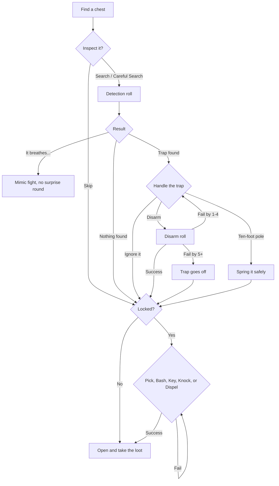

# UNDERKEEP — Traps, Locks & Treasure
*Companion to the Core Rule Set and the Bestiary. Everything the hero does outside combat: finding traps, disarming them, opening doors, cracking chests, and dealing with the dungeon's other hazards.*

---

## 1. Time Is the Hidden Cost

Every non-combat action moves the **step clock**, the same clock that triggers wandering monsters (a d6 check every 10 steps). Being careful is always possible, but it costs time, and time brings monsters.

| Action | Steps used |
|---|---|
| Search | 5 |
| Careful Search | 20 |
| Pick a lock | 5 |
| Disarm a trap | 5 |
| Bash a door or chest | 2 (plus a noise check) |
| Use a key, pole, or item | 1 |
| Cast Knock or Dispel Ward | 1 / 5 |

**Conditions outside combat:** 1 round = 1 step. Poison outside combat deals 1d4 every 10 steps until cured or the hero passes a Body save (rolled each time).

---

## 2. Difficulty Tiers

Every trap and lock has a **tier**. **F** means the current floor number.

| Tier | Detect TN | Disarm / Pick TN | Save DC | Loot bonus on chests |
|---|---|---|---|---|
| Crude | 8 + F | 8 + F | 9 + F | +0 |
| Standard | 10 + F | 10 + F | 10 + F | +0 |
| Masterwork | 13 + F | 13 + F | 12 + F | +5 |
| Arcane | 14 + F | 14 + F (Dispel only) | 13 + F | +10 |

**Floor Dice (FD):** trap damage scales with depth: **1d6 per 2 floors, minimum 1d6.** Floors 1–2 deal 1d6, floors 3–4 deal 2d6, and so on up to 5d6 on floors 9–10.

A **natural 20** always succeeds and a **natural 1** always fails, as in the core rules.

---

## 3. Detecting Traps

Traps are hidden until detected. There are three ways to find them.

### Passive Notice (automatic)

Whenever the hero is about to step onto a hidden trap, or opens a door or chest without searching it first, the game secretly rolls:

> **d20 + WIT mod + detection bonuses − 4** vs. the trap's Detect TN

On a success, the hero stops **before** the trap fires and the log says *"You notice something odd…"* The trap is now marked as found.

### Search (active)

Tap **Search**. The hero checks their own tile, the tile ahead, and any door or chest in front of them.

> **d20 + WIT mod + detection bonuses** vs. Detect TN (no −4 penalty)

### Careful Search

The same roll with **advantage**, but it costs 20 steps. It's the right choice for a chest that looks valuable.

**Search limits:** each object can get one Search and one Careful Search. After that, the hero has learned all they can until something changes.

### What a Search Reveals

| Result | What the hero learns |
|---|---|
| Fail | *"You find nothing."* This is shown whether or not a trap is actually there. |
| Success | *"It's trapped!"* The type is unknown, so disarming it is at −2. |
| Success by 5+ | The exact trap type and tier (for example, *"Masterwork Poison Needle"*). |

### Magical Traps

Arcane traps (glyphs, runes, and sigils) can be found with the **better of WIT or INT**. The **Lore** skill adds +3 and reveals the exact type on any success.

### Darkness

Without light, the hero can't Search at all. Arcane traps glow faintly, so they can still be noticed passively (without the −4 penalty).

### Detection Bonuses

| Source | Bonus |
|---|---|
| Keen Senses (Spirit) | +3 per rank; rank 2 also warns when a hidden trap or secret door is within 1 tile |
| Trapfinding (Shadow) | +2 per rank; rank 2 removes the passive −4 penalty |
| Lore (Arcana) | +3 against magical traps only |
| Dust of Revealing (item) | Automatically reveals everything within 2 tiles |

---

## 4. Dealing with a Found Trap

Once a trap is found, the hero has four choices.

### 1. Disarm

Requires **lockpicks** for mechanical traps. Arcane traps are disarmed with **Dispel Ward** (without that skill, the roll uses INT and has disadvantage).

> **Mechanical:** d20 + AGI mod + Trapfinding bonus vs. Disarm TN
> **Arcane:** d20 + INT mod + Lore bonus + 4 (Dispel Ward) vs. Disarm TN

Apply −2 if the trap's type is unknown.

| Result | Outcome |
|---|---|
| Success by 10+ | Disarmed, and the hero **salvages** a part (see below) |
| Success | Disarmed. Earn trap XP |
| Fail by 1–4 | Nothing happens. The hero may try again (costs 5 more steps) |
| Fail by 5+, or natural 1 | **The trap goes off.** The hero saw it coming, so the save is normal |

### 2. Spring It with a Ten-Foot Pole

Only works on traps marked **Pole: Yes** in the tables below. No roll is needed.
- **Projectile, blade, needle, and pit traps** fire harmlessly and are used up.
- **Area traps** (gas, acid, fire) still reach the hero, but the save is made with advantage.
- Springing a trap gives **no XP**, and there's a 1-in-6 chance the pole breaks on blade and crushing traps.

### 3. Walk Around It

Floor traps can simply be avoided if another route exists. The map marks found traps with a red icon.

### 4. Ignore It

The hero opens the chest or door anyway and the trap fires. That's sometimes worth it with a full HP bar and a cheap trap.

### When a Trap Goes Off

- Traps that make an attack roll use **+F + 3** against the hero's DEF.
- Traps that force a save use the tier's Save DC.
- **If the trap was never detected**, the hero is caught off guard: saves are made with disadvantage, and attack traps get +2.

### Salvage (success by 10+)

| Trap | Salvaged item |
|---|---|
| Poison Needle / Dart Plate | **Poison Vial** — coat a weapon; your next hit Poisons |
| Gas Cloud / Gas Vent | **Sleep Bomb** — thrown; one enemy row makes a Mind save or falls Asleep |
| Fire Rune / Flame Jet | **Fire Pot** — thrown; 2d6 fire to one enemy |
| Crossbow Bolt | **Crossbow Parts** — sells for 50 gp |
| Anything else | **Trap Parts** — sells for 5 × floor gp |

---

## 5. Trap Catalog

### Floor Traps

Placed on corridor and room tiles. The dungeon generator places **4 + F** floor traps per floor.

| Trap | Floors | Tier | Effect | Pole |
|---|---|---|---|---|
| Alarm Tile | 1+ | Crude | An encounter starts immediately, with one extra monster | No |
| Pit | 1+ | Crude | Reflex save or fall for FD crush. Climbing out takes 10 steps | Yes |
| Dart Plate | 1+ | Standard | Attack: 1d4 + F pierce, and a Body save or Poisoned | Yes |
| Swinging Blade | 2+ | Standard | Reflex save or FD slash and Bleeding | Yes |
| Gas Vent | 3+ | Standard | Mind save or Asleep for 10 steps; an immediate wandering monster check, and any monsters get a surprise round | No |
| Spiked Pit | 3+ | Standard | As Pit, plus 1d6 pierce and Bleeding | Yes |
| Falling Block | 4+ | Standard | Reflex save or FD + 1d6 crush | Yes |
| Chute | 4+ | Standard | Reflex save or slide to a random tile on the floor below (no damage) | Yes |
| Flame Jet | 5+ | Standard | FD fire, Reflex save for half; Burning on a failed save | Yes |
| Teleport Glyph | 6+ | Arcane | Mind save or teleported to a random tile on this floor | No |
| Crushing Walls | 7+ | Masterwork | The walls start closing: the hero has **3 steps** to leave the corridor, or takes 2 × FD crush (Reflex save for half) | No |
| Soul Glyph | 8+ | Arcane | Body save or Drained | No |
| Frost Glyph | 9+ | Arcane | FD cold and Slowed, Reflex save for half damage and no Slow | No |

### Door Traps

About **1 door in 6** is trapped (1 in 4 on floors 6+). Door traps go off when the door is opened, bashed, or when a pick attempt fails by 5+.

| Trap | Floors | Tier | Effect | Pole |
|---|---|---|---|---|
| Alarm Chime | 1+ | Crude | Immediate encounter | No |
| Needle Lock | 1+ | Standard | 1d4 pierce, and a Body save or Poisoned | No (it's inside the lock) |
| Scything Door | 3+ | Standard | FD slash, Reflex save for half | Yes |
| Warding Rune | 5+ | Arcane | FD fire or cold (random), Reflex save for half | No |
| Sealing Glyph | 8+ | Arcane | Mind save or Paralyzed for 10 steps; immediate wandering monster check with surprise | No |

### Chest Traps

Roll by floor: **floors 1–3 roll d6, floors 4–7 roll d10, floors 8–10 roll d12.** The deeper the floor, the nastier the trap can be.

| Roll | Trap | Tier | Effect | Pole |
|---|---|---|---|---|
| 1 | Poison Needle | Crude/Std/MW | Body save or Poisoned | Yes |
| 2 | Spring Blade | Crude/Std/MW | FD slash, Reflex save for half | Yes |
| 3 | Stink Bomb | Crude | Body save or Sickened for the next combat. Noise: immediate wandering monster check | Advantage on save |
| 4 | Crossbow Bolt | Std/MW | Attack: 1d10 + F pierce | Yes |
| 5 | Alarm Bell | Crude/Std | Immediate encounter, with one extra monster | No |
| 6 | Gas Cloud | Std/MW | Mind save or Asleep for 10 steps; immediate wandering monster check with surprise | Advantage on save |
| 7 | Acid Spray | Std/MW | FD acid, Reflex save for half. On a failed save, one random potion or scroll the hero carries is destroyed | Advantage on save |
| 8 | Fire Rune | Arcane | FD + 1d6 fire, Reflex save for half. On a failed save, any scrolls inside the chest burn | No |
| 9 | Stunner | Std/MW | Body save or Paralyzed for 10 steps; immediate wandering monster check with surprise | No |
| 10 | Teleport Glyph | Arcane | Mind save or teleported. The chest stays put and is marked on the map | No |
| 11 | Curse Sigil | Arcane | Mind save or Weakened and lose 1d6 FP | No |
| 12 | Soul Leech | Arcane | Body save or Drained | No |

**Mechanical tier roll** (for traps marked Crude/Std/MW): d10 + F. **1–5** Crude, **6–11** Standard, **12+** Masterwork. If the result is a tier the trap doesn't list, use the closest tier it does.

---

## 6. Doors and Locks

### Door Types

The dungeon generator makes **25% of doors** stuck or locked, plus 2% per floor.

| Door | How to get through |
|---|---|
| **Open** | Walk through |
| **Stuck** | Bash only (TN 8 + F). Can't be picked |
| **Locked** | Pick, bash, Knock, or a Skeleton Key |
| **Keyed** | Its matching key (found elsewhere on the floor), or pick it at Masterwork TN + 2 |
| **Sealed** | Arcane lock. Only **Dispel Ward**, a Scroll of Dispel, or its **Rune Key** will open it |
| **Barred** | Can only be opened from the other side. Find another route |
| **Secret** | Hidden until found (see *Secret Doors*) |
| **One-Way** | Can be passed in one direction only. It looks like a wall from the other side |

**Lock tier** for a locked door or chest: roll d10 + F. **1–5** Simple (Crude TN), **6–11** Good (Standard TN), **12–15** Masterwork, **16+** Sealed.

### Ways to Open a Lock

| Method | Works on | Roll | Steps | Risk |
|---|---|---|---|---|
| **Pick** | Locked, Keyed, chest locks | d20 + AGI mod + Lockpicking bonus vs. Lock TN. Requires lockpicks | 5 | On any failure, a 1-in-6 chance the lockpicks break. A natural 1 or failing by 10+ **jams** the lock. Failing by 5+ sets off a Needle Lock |
| **Bash** | Stuck, Locked, chests | d20 + MIG mod + Brute Force bonus + crowbar vs. Lock TN + 2 | 2 | 2-in-6 chance the noise draws a wandering monster. **Chests:** any armed trap goes off, and a 1-in-3 chance one potion inside breaks |
| **Key** | Keyed | Automatic | 1 | None |
| **Skeleton Key** | Any lock except Sealed | Automatic; the key is used up | 1 | None |
| **Knock** (skill or scroll) | Simple and Good: automatic. Masterwork: d20 + INT mod vs. Lock TN | — | 1 | 1-in-6 noise check |
| **Dispel Ward** (skill or scroll) | Sealed | d20 + INT mod + Lore bonus + 4 vs. 14 + F | 5 | Failing by 5+ causes a backlash: FD force damage (can't be resisted) |

**Jammed locks** can no longer be picked. Only bashing, Knock, or a Skeleton Key will open them.

### Secret Doors

Each floor has **2–4 secret doors**, usually leading to shortcuts, treasure rooms, or stashes.

- Found with the same rules as traps: **d20 + WIT mod + Keen Senses bonus** vs. **12 + F** (−4 for passive notice).
- Passive notice is checked whenever the hero walks along the wall where the door is hidden.
- Finding one gives **10 × F XP**.

---

## 7. Treasure Chests

### Generating a Chest

Each floor has **3 + ⌊F ÷ 2⌋ chests**, plus any placed by bosses or special rooms.

| Property | Chance |
|---|---|
| Trapped | 20% + 5% × F (max 70%) |
| Locked | 30% + 5% × F (max 80%) |
| Is actually a **Mimic** | 0% on floors 1–4 · 3% on floors 5–7 · 8% on floors 8–10 |

### The Chest Sequence

When the hero faces a chest, the game shows a chest panel with what is known so far: **Lock** (always visible: *Unlocked*, *Simple*, *Good*, *Masterwork*, or *Sealed*) and **Trap** (*Unknown* until searched).



**Step by step:**

1. **Inspect** — Search or Careful Search. This is the only step that can find the trap or reveal a Mimic (Mimic Detect TN is 18; Lore reveals it automatically).
2. **Handle the trap** — Disarm, spring it with a pole, or ignore it.
3. **Unlock** — pick, bash, key, Knock, or Dispel Ward. **An armed trap can still go off here:** a pick that fails by 5+ sets off a Poison Needle, and bashing sets off any armed trap. This is why smart players disarm first.
4. **Open** — any trap that's still armed goes off now. If it was never found, the hero saves with disadvantage.
5. **Loot.**

If the hero skipped the Inspect step and the chest is a Mimic, the Mimic gets a free surprise round (see the Bestiary).

### Chest Contents

- **Gold:** F × 3d10.
- **Loot roll:** d100 + (LCK mod × 5) + tier bonuses on the Bestiary's loot table. A Masterwork trap or lock adds +5 each, and an Arcane trap or Sealed lock adds +10 each. **Harder chests give better loot.**
- **Boss chests** always contain one Rare item and are never trapped.

---

## 8. Dungeon Hazards

These aren't traps, but they're found with Search the same way (Detect TN 12 + F) and marked on the map once discovered.

| Hazard | Floors | Effect | Counter |
|---|---|---|---|
| **Spinner** | 2+ | Silently turns the hero to a random facing | Lodestone Compass, or find it with Search |
| **Dark Zone** | 4+ | Magical darkness: torches give no light and the map doesn't fill in | Light scroll lets the hero see 1 tile; otherwise feel your way through |
| **Deep Water** | 5+ | Each step in heavy armor: Body save (DC 10 + F) or 1d6 drowning damage. Each scroll carried has a 1-in-6 chance to be ruined | Take off heavy armor, or find another route |
| **Teleporter Pad** | 5+ | Always sends the hero to the same fixed spot, which makes it a mapping puzzle | Walk around it, or use it on purpose |
| **Anti-Magic Field** | 6+ | Active Arcana and Spirit skills and scrolls don't work; magic items give no bonus | Avoid fighting inside it |
| **Web Curtain** | 4 | Thick webbing blocks a corridor. It's visible, so no Search is needed | Burn it (torch, oil flask, or fire spell) or bash it (TN 10 + F) |
| **Ice Slide** | 9 | Visible ice. Stepping onto it slides you forward until you hit a wall or a non-ice tile; you can't turn while sliding | Plan the route; every ice room is guaranteed to have an exit |

### Curiosities

Rooms can also hold something strange to interact with. They're optional risks with rewards.

**Mysterious Fountain** (drink once; roll d6):

| d6 | Result |
|---|---|
| 1 | Poisoned |
| 2 | Teleported to a random tile |
| 3 | Nothing |
| 4 | Heal 2d6 HP |
| 5 | Restore all FP |
| 6 | +1 to a random attribute (each fountain works only once per game) |

**Offering Shrine:** donate 20 × F gold for a blessing: +2 to all saves until the next rest.

---

## 9. Skill Tree Changes

These changes are applied to the Core Rule Set. Every Path now has a way to deal with locks and traps, but Shadow is clearly the best at it.

| Path | Tier | Skill | Type | Ranks | Effect |
|---|---|---|---|---|---|
| Shadow | I | **Lockpicking** *(replaces Lockpicking & Traps)* | Passive | 3 | +2 per rank to pick locks. R2: lockpicks never break. R3: picking takes 1 step instead of 5 |
| Shadow | I | **Trapfinding** *(new)* | Passive | 3 | +2 per rank to detect and disarm traps. R2: no −4 penalty on passive notice. R3: salvage on success by 5+ instead of 10+ |
| Shadow | II | **Nimble Fingers** *(new)* | Passive | 1 | Disarming takes 1 step. Once per trap, a disarm that fails by 5+ counts as a plain failure instead of setting it off |
| Blade | I | **Brute Force** *(new)* | Passive | 2 | +3 per rank to bash doors and chests. R2: bashing a chest never breaks its contents, and the noise check drops to 1-in-6 |
| Arcana | I | **Knock** *(new)* | Active, 2 FP | 1 | Opens a Simple or Good lock automatically; Masterwork needs an INT check. Out of combat only |
| Arcana | I | **Lore** *(expanded)* | Passive | 1 | Also: +3 to detect and dispel magical traps, identifies their type on any success, and reveals Mimics automatically |
| Arcana | II | **Dispel Ward** *(new)* | Active, 3 FP | 1 | Disarm an Arcane trap or open a Sealed lock, with +4 to the INT roll |
| Spirit | I | **Keen Senses** *(expanded)* | Passive | 2 | +3 per rank to find traps, secret doors, and hazards. R2: can't be surprised, and the hero is warned (*"Your skin prickles…"*) when a hidden trap or secret door is within 1 tile |

**Origin change:** the Cutpurse now starts with **Lockpicking (rank 1)**, and its kit includes a ten-foot pole.

---

## 10. Gear

| Item | Effect | Slots | Cost |
|---|---|---|---|
| Lockpicks | Required to pick locks and disarm mechanical traps. 1-in-6 chance to break when a pick fails | 1 | 15 gp |
| Masterwork Lockpicks | +2 to pick and disarm; never break | 1 | 150 gp |
| Ten-Foot Pole | Spring traps safely (see *Spring It*) | 2 | 5 gp |
| Crowbar | +2 to bash; can be swung as a 1d4 crush weapon | 1 | 10 gp |
| Lodestone Compass | Always shows the hero's facing; spinners can't fool the hero | 1 | 30 gp |
| Dust of Revealing | Single use: reveals every hidden trap, secret door, and hazard within 2 tiles | 1 | 40 gp |
| Scroll of Knock | Casts Knock | 1 | 50 gp |
| Scroll of Dispel | Casts Dispel Ward (uses the hero's INT) | 1 | 80 gp |
| Skeleton Key | Opens any lock except Sealed; used up | 1 | Found only |
| Rune Key | Opens one specific Sealed door | 1 | Found only |

---

## 11. XP for Non-Combat Actions

This gives rogue-style builds a steady source of XP without fighting.

| Action | XP |
|---|---|
| Disarm a trap | 10 × F |
| Pick a lock | 5 × F |
| Open a Sealed lock | 15 × F |
| Find a secret door | 10 × F |
| Find a hazard | 5 × F |

Masterwork traps and locks give **×2 XP**; Arcane traps give **×3**. Springing a trap with a pole, bashing, and using a key give **no XP**.

---

## 12. Mobile Interface

- **Context button:** when the hero faces a door or chest, the main exploration button becomes **Inspect**. Once the object has been inspected, it becomes the next logical step (*Disarm*, *Unlock*, or *Open*).
- **Chest panel:** a small card showing the chest with two status icons, **Lock** and **Trap**, and buttons for **Search**, **Careful**, **Disarm**, **Pole**, **Pick**, **Bash**, **Key/Spell**, **Open**, and **Leave**. Unusable buttons are dimmed with a short reason (*"Needs lockpicks"*).
- **Odds hint (optional setting):** show the hero's success chance next to each button (*"Pick: 65%"*). Classic mode hides it.
- **Map icons:** red for found traps, blue for hazards, a keyhole for locked doors, and a gold outline for chests not yet opened.
- **Log flavor:** every result gets a short classic-style line (*"A click… and a needle snaps out!"*).

---

## 13. Data Templates

```json
{
  "id": "chest_f4_02",
  "type": "chest",
  "floor": 4,
  "pos": [12, 7],
  "lock": { "tier": "good", "jammed": false },
  "trap": { "kind": "gas_cloud", "tier": "standard", "armed": true, "found": false, "typeKnown": false },
  "searches": { "normal": false, "careful": false },
  "mimic": false,
  "loot": { "gold": "4*3d10", "rollBonus": 0 }
}
```

```json
{
  "id": "gas_cloud",
  "placement": ["chest", "floor"],
  "minFloor": 3,
  "tiers": ["standard", "masterwork"],
  "poleable": "advantage",
  "effect": {
    "save": "mind",
    "condition": "asleep",
    "durationSteps": 10,
    "then": { "wanderingCheck": true, "enemySurprise": true }
  },
  "salvage": "sleep_bomb"
}
```
